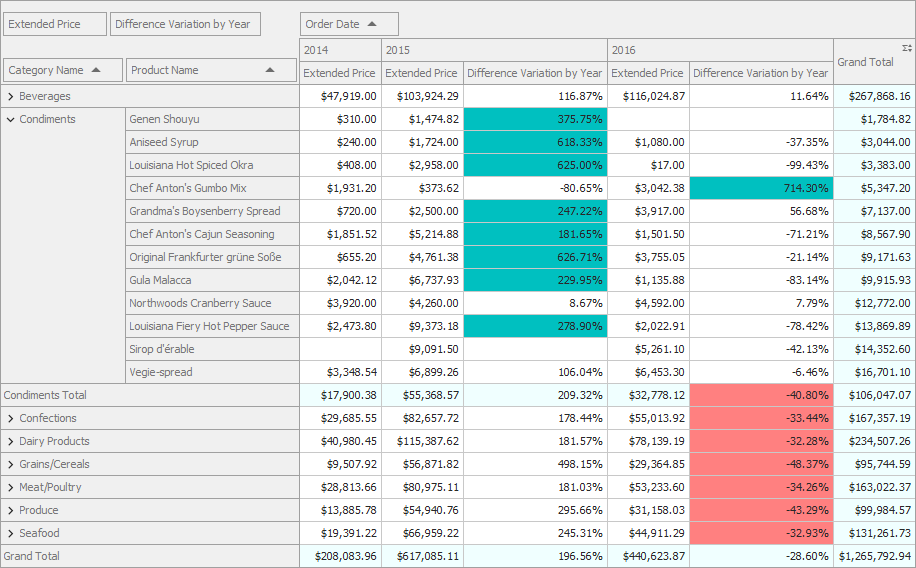

<!-- default badges list -->

<!-- default badges end -->
# Pivot Grid for WinForms - Walkthrough Tutorial

The following example contains the source code used in the tutorials that explain how to get started with the Pivot Grid. The following image illustrates the resulting UI: 

## Files to Look At

- [Form1.cs](./CS/WinPivot_GettingStarted/Form1.cs) (VB: [Form1.vb](VB/WinPivot_GettingStarted/Form1.vb))

## Documentation

- [Tutorial 1 - Add the Pivot Grid and Bind It to Data](http://docs.devexpress.com/WindowsForms/12005/controls-and-libraries/pivot-grid/getting-started/pivot-grid-walkthroughs/tutorial-1-bind-a-pivot-grid-to-an-mdb-database)
- [Tutorial 2 - Populate the Pivot Grid with Data and Configure Field Layout](http://docs.devexpress.com/WindowsForms/404089/controls-and-libraries/pivot-grid/getting-started/pivot-grid-walkthroughs/tutorial-2-populate-pivot-grid-fields-with-data-and-configure-layout)
- [Tutorial 3 - Configure Displayed Data for Analysis](http://docs.devexpress.com/WindowsForms/404091/controls-and-libraries/pivot-grid/getting-started/pivot-grid-walkthroughs/tutorial-3-configure-displayed-data-for-analysis)
- [Tutorial 4 - Customize the Pivot Grid Appearance](http://docs.devexpress.com/WindowsForms/404093/controls-and-libraries/pivot-grid/getting-started/pivot-grid-walkthroughs/tutorial-4-appearance-customization)

## More Examples

- [Pivot Grid for WinForms - How to Connect the Pivot Grid to an OLAP Data Source](https://github.com/DevExpress-Examples/winforms-pivot-grid-connect-to-an-olap-datasource)
- [Pivot Grid for WPF - Bind the Pivot Grid to an MS Access Database at Runtime](https://github.com/DevExpress-Examples/wpf-pivot-grid-connect-to-an-access-database-in-code)
- [ASP.NET Pivot Grid - Bind a Pivot Grid to an MS Access Database at Design Time](https://github.com/DevExpress-Examples/aspnet-pivot-grid-getting-started-bind-a-pivot-grid-to-an-mdb-database-runtime-sample-t540964)
<!-- feedback -->
## Does this example address your development requirements/objectives?

 

(you will be redirected to DevExpress.com to submit your response)
<!-- feedback end -->
